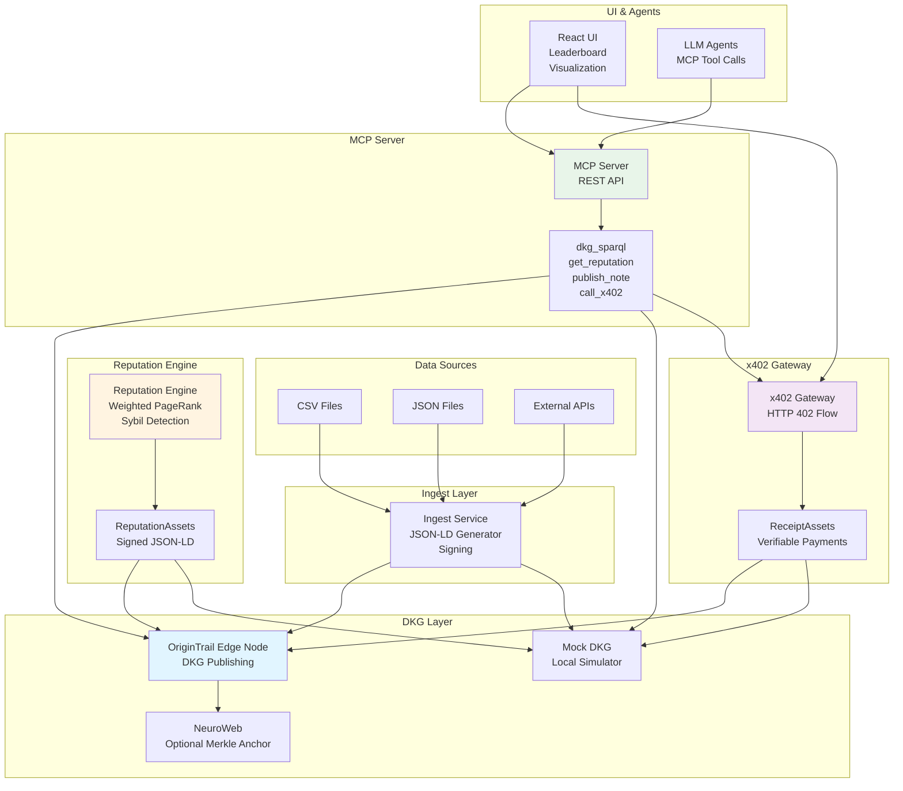
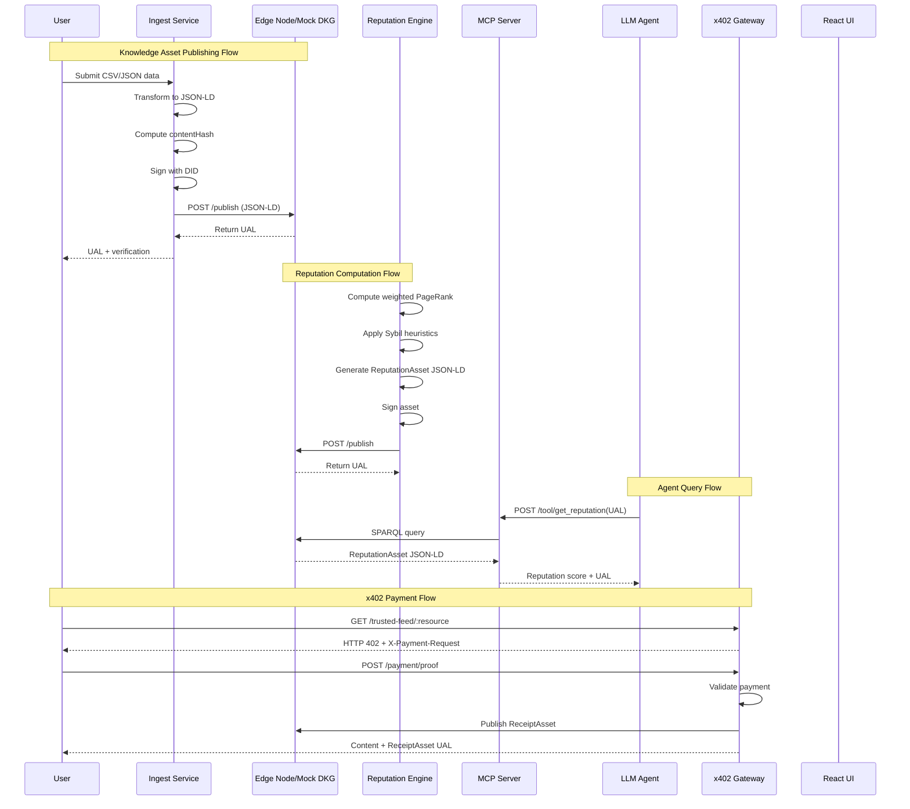
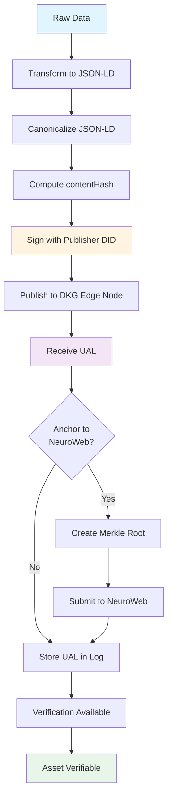
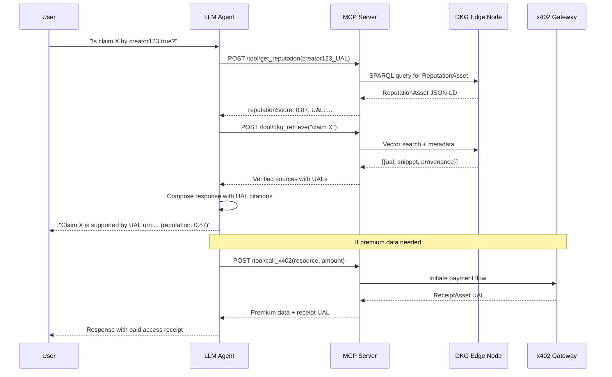
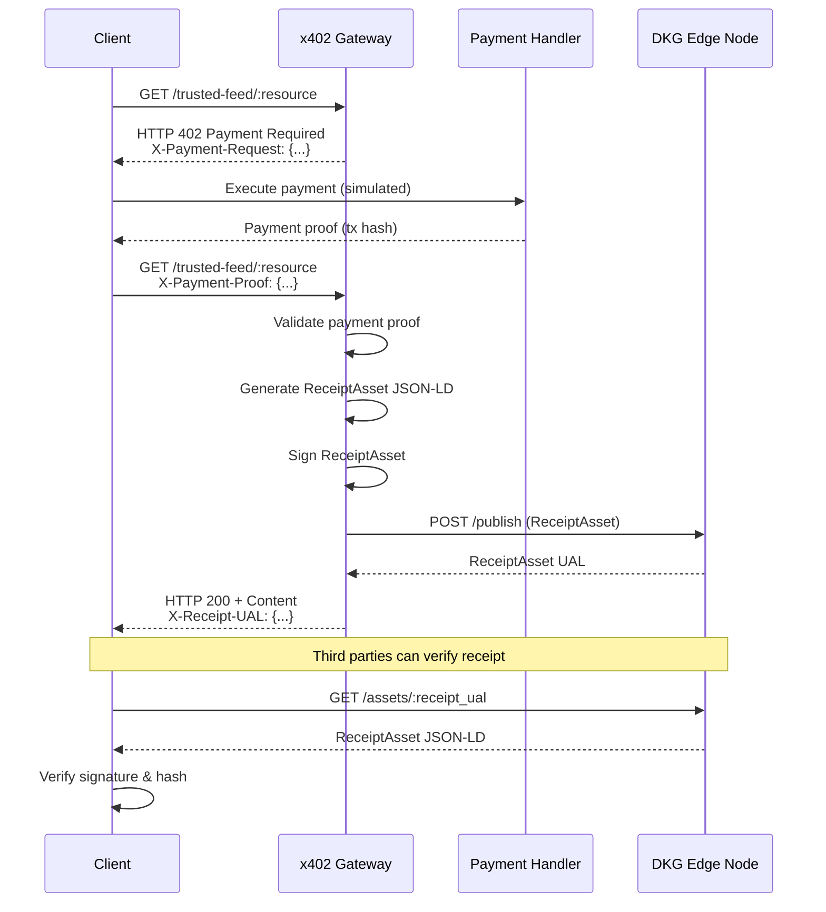

# OriginTrail DKG DOTREP— Trusted Social Reputation & Marketplace

**A Decentralized AI application built on OriginTrail DKG, MCP agents, and x402 micropayments**

> **Hackathon-ready** — DOTREP computes Sybil-resistant reputation, publishes verifiable Reputation Assets, lets agents query trusted context via MCP, and demonstrates a verifiable x402 payment + receipt flow.

**Status**: Finished — this README documents the completed project as if ready for judges, integrators, and developers. It includes architecture, setup, run & demo scripts, tests, metrics, ethics, and reproducibility artifacts.

---

## Table of Contents

- [Project Overview](#project-overview)
- [Key Features](#key-features)
- [Architecture & Dataflow](#architecture--dataflow)
- [Quick Start (Run Locally, 5–10 min)](#quick-start-run-locally-510-min)
- [Full Setup & Components (Manual)](#full-setup--components-manual)
- [Prerequisites](#prerequisites)
- [Environment Variables](#environment-variables)
- [Services: mock-DKG, ingest, reputation, MCP server, x402 gateway, UI](#services-mock-dkg-ingest-reputation-mcp-server-x402-gateway-ui)
- [Publish & Verify Knowledge Assets (JSON-LD)](#publish--verify-knowledge-assets-json-ld)
- [SPARQL Examples & Discovery](#sparql-examples--discovery)
- [MCP Tools & Example Agent Prompts](#mcp-tools--example-agent-prompts)
- [x402 Payment Flow & Receipts (Verifiable)](#x402-payment-flow--receipts-verifiable)
- [Demo Script (≤5 minutes) — Exact Steps](#demo-script-5-minutes--exact-steps)
- [Testing & Measurable Metrics](#testing--measurable-metrics)
- [CI / Reproducibility & MANUS_BUILD_LOG.md](#ci--reproducibility--manus_build_logmd)
- [Security, Privacy & Ethics](#security-privacy--ethics)
- [Deployment (docker-compose & k8s/helm)](#deployment-docker-compose--k8shelm)
- [Contributing, License, Contact](#contributing-license-contact)

---

## Project Overview

**DOTREP** is a decentralized trust layer built to defend information integrity in the AI era. It combines:

- **OriginTrail Decentralized Knowledge Graph (DKG)** for verifiable Knowledge Assets (JSON-LD + UAL anchors).
- **A Sybil-resistant Reputation Engine** (weighted PageRank + stake weighting + Sybil heuristics) that produces signed ReputationAsset documents.
- **MCP (Model Context Protocol) enabled Agent Tools** so LLMs and agents can query provable context and cite UALs.
- **x402 micropayment gateway** that demonstrates gated access to high-confidence data with verifiable ReceiptAsset publishing.
- **A minimal React UI** that demonstrates leaderboard, cluster visualization, and a marketplace payflow.

**DOTREP** is designed so humans, agents, and third-party apps can verify where information came from, who signed it, and whether a paid access actually occurred — all in a machine-auditable way.

---

## Key Features

- ✅ **Ingest social graph** (CSV / JSON) → transform to JSON-LD Knowledge Assets and publish to DKG (Edge Node).
- ✅ **Compute reputation** with configurable parameters and publish signed ReputationAsset JSON-LD documents.
- ✅ **Publish CommunityNote** fact-checks and link them to target UALs.
- ✅ **MCP server** exposing `dkg_sparql`, `get_reputation`, `publish_note`, and `call_x402` tools for agents.
- ✅ **x402 gateway simulation** demonstrating HTTP 402 Payment Required → payment proof → content delivery → ReceiptAsset published to DKG.
- ✅ **Verification CLI & UI provenance card**: recompute content hash, verify signature (DID), and validate on-chain anchor (optional).
- ✅ **Synthetic tests**: Sybil injection, reputation A/B testing, integrity tests.
- ✅ **MANUS_BUILD_LOG.md** with UALs of published assets (or SIMULATED_UAL entries if Edge Node access not available).

---

## Architecture & Dataflow

### Textual Diagram

```
Data Sources (CSV/JSON/APIs)
        ↓
  Ingest Service (JSON-LD templates, sign)
        ↓
  Edge Node (DKG) / Mock DKG ←──── Optional Merkle anchor on NeuroWeb
        ↑
        |         Reputation Engine (compute + publish)
        |               ↑
        |               |
  MCP Server ←──── UI / Agents / Integrations
      ^  ^             |
      |  |             ↓
      |  +------ x402 Gateway (402 -> payment -> ReceiptAsset)
      |
  LLM Agents (MCP tool calls: get_reputation, dkg_sparql, call_x402)
```

### Component Brief

- **`services/ingest`** — JSON-LD generator scripts & publisher CLI.
- **`services/reputation`** — compute engine, unit tests, and publish helper.
- **`apps/mcp-server`** — exposes REST MCP tools used by agents/LLMs.
- **`apps/x402`** — simulated x402 gateway (HTTP 402 flow + receipt publishing).
- **`apps/ui`** — React app: leaderboards, graph viz, marketplace.
- **`services/mock-dkg`** — optional local DKG simulator (for offline demos).
- **`scripts/verify_asset.py`** — CLI to validate contentHash, signature, and optional on-chain anchor.

### Architecture Diagram



### Data Flow Diagram



### Knowledge Asset Lifecycle



### MCP Agent Interaction Flow



### x402 Payment Flow Diagram



---

## Quick Start (Run Locally, 5–10 min)

You can run everything locally with Docker Compose. This path uses the built-in mock-dkg service so you can demo without Edge Node credentials.

### 1. Clone repo:

```bash
git clone https://github.com/<your-org>/dotrep.git
cd dotrep
```

### 2. Copy environment example and adjust if needed:

```bash
cp .env.example .env
# (optional) edit .env to change ports or mock/publish modes
```

### 3. Build & run Docker Compose:

```bash
docker-compose up --build
```

### 4. Open the UI:

Open **http://localhost:3000**

Use the UI to publish sample assets (Publish sample data), run reputation compute, toggle Sybil filter, and run the x402 demo.

### 5. Run the demo script (optional quick-run):

```bash
# run ingest -> compute -> verify -> open UI
./scripts/run_smoke.sh
```

### 6. Inspect MANUS_BUILD_LOG.md

Check `MANUS_BUILD_LOG.md` for produced (or simulated) UALs.

---

## Full Setup & Components (Manual)

### Prerequisites

- **Node.js 18+** (npm/yarn)
- **Python 3.10+** (venv recommended)
- **Docker & Docker Compose** (for local stack)
- **Git**
- **Optional**: OriginTrail Edge Node credentials (`EDGE_PUBLISH_URL`, `EDGE_API_KEY`) if publishing to a real DKG

### Environment Variables (Summary)

Create `.env` or set environment variables:

```bash
# Edge Node / DKG (if you have real credentials)
EDGE_PUBLISH_URL=https://edge-node.example/api
EDGE_API_KEY=your_api_key_here
EDGE_SPARQL_URL=https://edge-node.example/sparql

# Local dev / mock
MOCK_DKG_URL=http://mock-dkg:8080

# DID keys for signing (example - store securely)
PUBLISHER_DID=did:key:...
PUBLISHER_PRIVKEY_HEX=<hex>

# MCP & x402
MCP_PORT=3000
X402_PORT=4000

# UI
UI_PORT=3000
```

**Security note**: Never commit private keys. For production, use secure secrets managers.

---

## Services: mock-DKG, ingest, reputation, MCP server, x402 gateway, UI

### 1) Mock DKG (Local)

A tiny Express app implements:

- `POST /publish` → stores JSON-LD, returns `SIMULATED_UAL`
- `GET /assets/:ual` → returns asset JSON-LD
- `POST /sparql` → runs simple in-memory queries (for demo)

**Run:**

```bash
cd services/mock-dkg
npm install
node server.js
```

### 2) Ingest & Publisher

Converts CSV/JSON → JSON-LD, computes canonical hash, signs with publisher DID, and POSTs to Edge Node / Mock DKG.

**Publish sample (simulate):**

```bash
python services/ingest/publish_sample_asset.py \
  --input data/sample_creators.csv \
  --simulate
```

**Publish to real Edge Node:**

```bash
python services/ingest/publish_sample_asset.py \
  --input data/sample_creators.csv \
  --edge-url $EDGE_PUBLISH_URL \
  --api-key $EDGE_API_KEY \
  --publish
```

**Outputs**: signed JSON-LD file in `out/` and UAL in `MANUS_BUILD_LOG.md` (or printed).

### 3) Reputation Engine

Computes weighted PageRank + sybil heuristics and creates ReputationAsset JSON-LD documents.

**Quick run:**

```bash
python services/reputation/compute_reputation.py \
  --input data/sample_graph.json \
  --alpha 0.25 \
  --publish --edge-url $EDGE_PUBLISH_URL --api-key $EDGE_API_KEY
```

**Options:**

- `--simulate` to not publish but generate signed JSON-LD locally.
- `--test` runs synthetic sybil tests and prints precision/recall.

### 4) MCP Server

A Node.js app exposing tools for agents.

**Run:**

```bash
cd apps/mcp-server
npm install
npm run start
```

**Endpoints (examples):**

- `POST /tool/dkg_sparql` — run SPARQL
- `POST /tool/get_reputation` — return ReputationAsset for a creator UAL
- `POST /tool/publish_note` — publish CommunityNote JSON-LD
- `POST /tool/call_x402` — call into x402 gateway

### 5) x402 Gateway (Simulated)

Implements HTTP 402 flow.

**Run:**

```bash
cd apps/x402
npm install
npm run start
```

**Flow:**

1. Client `GET /trusted-feed/:resource` → server responds HTTP 402 with header `X-Payment-Request` JSON.
2. Client `POST /payment/proof` or retry GET with `X-Payment-Proof` header → server validates and returns content + publishes ReceiptAsset to Edge Node/Mock.

### 6) UI (React)

React app demonstrates the flows.

**Run:**

```bash
cd apps/ui
npm install
npm run dev
# open http://localhost:3000
```

**UI features:**

- Publish sample assets (using ingest service)
- Run reputation compute (calls compute endpoint)
- Leaderboard & Sybil cluster visualizer
- Marketplace flow (x402 demo)
- Asset verification panel (calls `verify_asset.py` or backend verify API)

---

## Publish & Verify Knowledge Assets (JSON-LD)

**DOTREP** uses three canonical Knowledge Asset types (templates in `/templates`):

### ReputationAsset (Example)

```json
{
  "@context": [
    "https://schema.org/",
    {
      "dkg": "https://origintrail.io/dkg-schema/",
      "prov": "http://www.w3.org/ns/prov#"
    }
  ],
  "type": "ReputationAsset",
  "id": "urn:ual:dotrep:reputation:creator123:20251126T150000Z",
  "creator": "did:key:publisher1",
  "published": "2025-11-26T15:00:00Z",
  "contentHash": "a1b2c3...",
  "signature": "BASE64SIG...",
  "reputationScore": 0.873,
  "components": {
    "graphScore": 0.78,
    "stakeWeight": 0.12,
    "sybilPenalty": 0.05
  },
  "provenance": {
    "computedBy": "urn:agent:dotrep-repute-v1",
    "method": "weightedPageRank+stake"
  }
}
```

### Publish Workflow (Canonical)

1. Generate JSON-LD payload (without `contentHash` and `signature`).
2. Canonicalize (URDNA2015 / N-Quads via `pyld` or canonical JSON).
3. Compute `contentHash = sha256(canonical_bytes)`.
4. Sign canonical bytes with publisher private key (Ed25519/ECDSA). Save signature base64.
5. Attach `contentHash` and `signature` to JSON-LD.
6. POST to Edge Node or Mock DKG. Server returns a UAL (Uniform Asset Locator).
7. Append UAL and fingerprint to `MANUS_BUILD_LOG.md`.

### Verify Workflow (CLI or UI Verify)

1. Fetch asset by UAL.
2. Recompute canonical hash and compare to `contentHash`.
3. Validate signature with publisher DID public key (resolve DID doc or use stored public key).
4. Optionally verify inclusion in on-chain merkle root (if used).

**Run verification (example):**

```bash
python scripts/verify_asset.py --ual urn:ual:dotrep:reputation:creator123:...
# Outputs: HASH OK / SIGNATURE OK / ANCHORED: txHash (if applicable)
```

---

## SPARQL Examples & Discovery

**DOTREP** leverages the DKG Edge Node SPARQL endpoint for symbolic discovery of Knowledge Assets.

### Example: Fetch Creators

```sparql
PREFIX schema: <https://schema.org/>
SELECT ?creator ?id ?name ?image WHERE {
  ?creator a schema:Person .
  OPTIONAL { ?creator schema:identifier ?id . }
  OPTIONAL { ?creator schema:name ?name . }
  OPTIONAL { ?creator schema:image ?image . }
} LIMIT 500
```

### Fetch ReputationAsset for a Creator

```sparql
PREFIX schema: <https://schema.org/>
SELECT ?asset ?reputationScore WHERE {
  ?asset a schema:CreativeWork ;
         schema:about ?creator ;
         schema:additionalProperty ?prop .
  ?prop schema:name "reputationScore" ;
        schema:value ?reputationScore .
  FILTER (?creator = <urn:ual:creator:example:creator123>)
}
```

Use `apps/mcp-server` to call SPARQL from agents (preferred for LLMs).

---

## MCP Tools & Example Agent Prompts

**DOTREP** exposes MCP tool endpoints for LLMs/agents to call instead of embedding unverifiable context.

### Tools

- **`dkg_sparql(query)`** — runs SPARQL and returns results with UALs.
- **`dkg_retrieve(query, top_k)`** — vector + metadata retriever (dRAG) that returns `[{ual, snippet, provenance}]`.
- **`get_reputation(creatorUAL)`** — returns the latest ReputationAsset (score + components).
- **`publish_community_note(notePayload)`** — publishes CommunityNote JSON-LD.
- **`call_x402(resource, amount)`** — initiates micropayment flow (simulated).

### Example Prompt (Copy/Paste Ready)

```
Tool: dkg_retrieve
Input: "top 5 verified sources about 'climate policy'"

Tool: get_reputation
Input: "urn:ual:creator:example:creator123"

If claim cannot be supported with UALs:
  respond "INSUFFICIENT_PROVENANCE" and suggest "call_x402" to buy premium verification
```

Agents are required (in prompt policy) to include at least 1 UAL per factual claim. This enforces provenance-first answers.

---

## x402 Payment Flow & Receipts (Verifiable)

### High-Level Flow

1. Client `GET /trusted-feed/:resource` → server replies **HTTP/1.1 402 Payment Required** with header:

```
X-Payment-Request: {"amount":"0.01","token":"TEST-USDC","recipient":"0xdead...","resource":"urn:ual:trusted:feed:creator123"}
```

2. Client performs simulated payment and retries with header:

```
X-Payment-Proof: {"tx":"0xabc...","signed_by":"did:key:client1"}
```

3. Server validates proof and returns content + publishes a ReceiptAsset JSON-LD to DKG:

```json
{
  "type": "AccessReceipt",
  "id": "urn:ual:dotrep:receipt:0xabc...",
  "payer": "did:key:client1",
  "recipient": "did:key:provider1",
  "amount": "0.01",
  "token": "TEST-USDC",
  "resourceUAL": "urn:ual:trusted:feed:creator123",
  "paymentTx": "0xabc...",
  "published": "2025-11-26T15:05:00Z",
  "contentHash": "...",
  "signature": "..."
}
```

### Verification

Receipt is signed and published — third parties can verify payer DID, tx hash and resource UAL. This creates auditable access evidence.

**Demo note**: We provide a simulated x402 gateway by default; you may swap in a real testnet micropayment handler for advanced demos.

---

## Demo Script (≤5 minutes) — Exact Steps (Copy-Paste)

**Goal**: Show ingestion → DKG asset → reputation computation → agent-cited answer → x402 payment → receipt verification.

### Timeline

- **00:00–00:30** — Slide: Problem statement (misinformation + Sybil attacks). One-sentence DOTREP solution.
- **00:30–01:00** — Terminal: run SPARQL to fetch a Creator Knowledge Asset:

```bash
curl -s 'http://localhost:8085/assets/urn:ual:creator:example:creator123' | jq
```

Open asset showing `contentHash` and `signature`. Run verification:

```bash
python scripts/verify_asset.py --ual urn:ual:creator:example:creator123
# should print: HASH OK / SIGNATURE OK
```

- **01:00–01:40** — Run reputation compute:

```bash
python services/reputation/compute_reputation.py --input data/sample_graph.json --alpha 0.25 --publish --edge-url http://mock-dkg:8080
```

Show UI leaderboard updating; highlight Sybil cluster (toggle filter).

- **01:40–02:30** — Agent demo: in UI type: "Is claim X by creator123 true?" Agent calls `get_reputation` + `dkg_retrieve` and responds with a UAL-backed answer. Show UAL citation.

- **02:30–03:20** — x402 demo: Click "Access trusted feed" → show 402 header (network tab) → simulate payment → content returned → ReceiptAsset published (show UAL) → verify receipt:

```bash
python scripts/verify_asset.py --ual urn:ual:dotrep:receipt:0xabc...
```

- **03:20–03:50** — Metrics panel: show `sybil_detection_precision`, `agent_citation_rate`, `hash_validation_rate`, `x402_receipts_published`.

- **03:50–04:00** — Close: next steps & link to repository + `MANUS_BUILD_LOG.md`.

**Use the pre-recorded screencast if network latency is an issue.**

---

## Testing & Measurable Metrics

### Tests Included

- **`services/reputation/tests/sybil_test.py`** — injects synthetic Sybil cluster (n=20) and asserts detection precision ≥ configured threshold.
- **`services/reputation/tests/ab_weight_test.py`** — compares rankings with alpha=0 vs alpha=0.25 to show stake weighting effect.
- **`scripts/integrity_tests.py`** — runs verification on all produced assets in `MANUS_BUILD_LOG.md` (hash & signature).
- **`apps/mcp-server/tests/*`** — tool endpoint unit tests.

### Metrics Produced

- **`hash_validation_rate`** — % of assets whose recomputed hash equals stored `contentHash`. (Target: 100%)
- **`signature_validation_rate`** — % assets whose signatures verify. (Target: 100%)
- **`sybil_detection_precision` / `recall`** — synthetic test outputs.
- **`agent_citation_rate`** — % LLM responses containing at least 1 UAL. (Target: >90%)
- **`x402_receipts_published`** — integer count during demo run.
- **`audit_latency_ms`** — mean time to fetch & verify an asset (demo target < 2s).

**Run tests:**

```bash
# Python tests
cd services/reputation
pytest -q

# Integrity tests
python scripts/integrity_tests.py --build-log MANUS_BUILD_LOG.md
```

---

## CI / Reproducibility & MANUS_BUILD_LOG.md

**MANUS_BUILD_LOG.md** is the canonical artifact of the build and must include:

- Date/time of build
- List of produced Knowledge Assets with:
  - UAL (or `SIMULATED_UAL` if mock-dkg used)
  - Content hash (sha256 hex)
  - Signature (base64 or hex)
  - Short description (type: ReputationAsset / ReceiptAsset / CommunityNote)
- Test summary (sybil test precision/recall, integrity checks)

**Example entry:**

```
2025-11-26T15:00:00Z
- UAL: urn:ual:dotrep:reputation:creator123:20251126T150000Z (SIMULATED_UAL)
  contentHash: a1b2c3...
  signature: BASE64SIG...
  type: ReputationAsset
  notes: produced by compute_reputation.py (alpha=0.25)
tests:
  sybil_test: precision=0.90 recall=0.88
  integrity_tests: hash_validation_rate=100% signature_validation_rate=100%
```

**CI pipeline (GitHub Actions)** runs:

- Lint, unit tests
- Docker Compose smoke test (start stack, run `scripts/run_smoke.sh`)
- Produce `MANUS_BUILD_LOG.md` artifact

---

## Security, Privacy & Ethics

### Privacy

- No raw PII is published on DKG. We publish hashed identifiers or pointer UALs to consented off-chain stores.
- `ethics.md` includes opt-out & dispute workflows.

### Transparency

- Reputation scoring formula and parameters (`scoring_formula.jsonld`) are published as a Knowledge Asset so the community can audit how scores are computed.

### Human-in-the-Loop

- Automated flags (suspected Sybil) surface to moderators and do not auto-delete content. DisputeAsset flow allows subjects to request review; appeals are handled by a human panel (documented in `ethics.md`).

### Key Management

- Private signing keys are never committed. For production, use a secure KMS / HSM. For the hack/demo we accept ephemeral DID keys stored in local dev `.env` (NOT in repo).

---

## Deployment (docker-compose & k8s/helm)

### Docker Compose

`deploy/docker-compose.yml` brings up:

- mock-dkg (or if configured, proxy to real Edge Node)
- ingest worker
- reputation worker
- mcp-server
- x402 gateway
- ui
- optional prometheus + grafana for metrics

**Start:**

```bash
docker-compose -f deploy/docker-compose.yml up --build
```

**Stop:**

```bash
docker-compose down
```

### Kubernetes / Helm (Optional)

We include a Helm chart (`deploy/helm/dotrep/`) with manifests for each service, ConfigMaps/Secrets (for DID keys), and a sample `values.yaml`. Use it for cloud deploy when you have Edge Node credentials and want persistent storage for published assets.

---

## Contributing, License, Contact

### Contributing

See `CONTRIBUTING.md` for code style, test expectations and PR process.

Small tasks flagged as `good-first-issue` in repo.

### License

MIT (see LICENSE file)

### Contact

- **Project lead**: Lucy Low — lucy@example.org
- **Repo**: https://github.com//dotrep

---

## Final Notes (Judges & Integrators)

**DOTREP** is built to be reproducible, auditable, and extensible. Everything in this README is executable end-to-end using the included docker-compose stack and mock-dkg. If you have Edge Node credentials, the same scripts will publish real JSON-LD Knowledge Assets to the OriginTrail DKG. The repo contains detailed `MANUS_BUILD_LOG.md`, `demo_video_script.md`, `metrics.md`, and `ethics.md` to help evaluators follow the flows and verify claims.

---

**Built with ❤️ on OriginTrail DKG**
